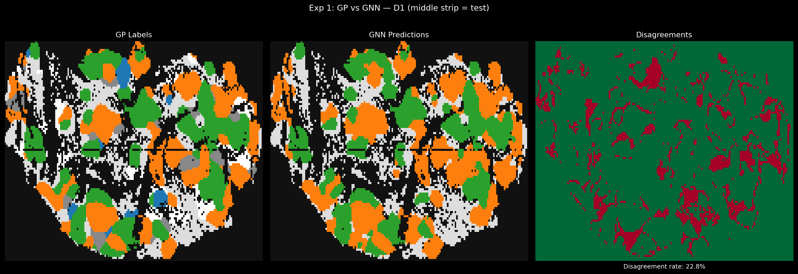
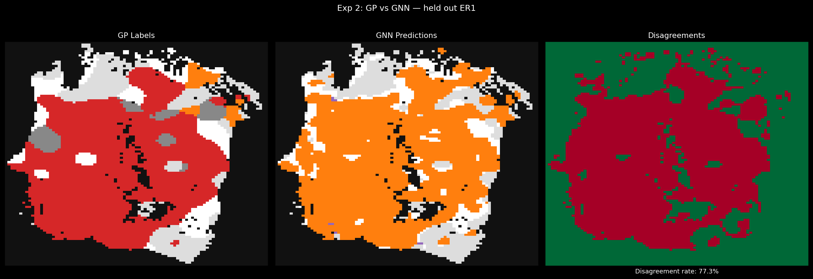
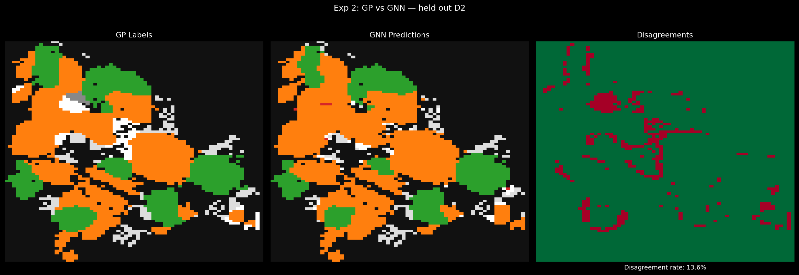
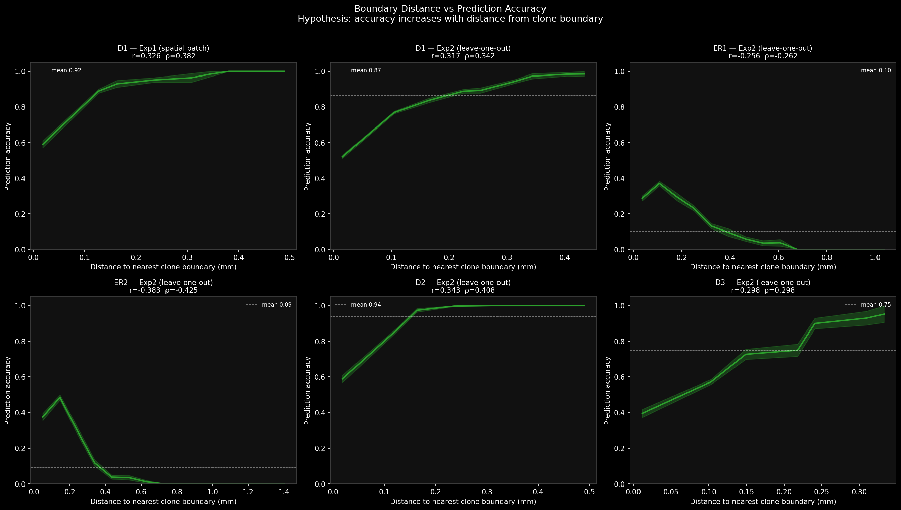
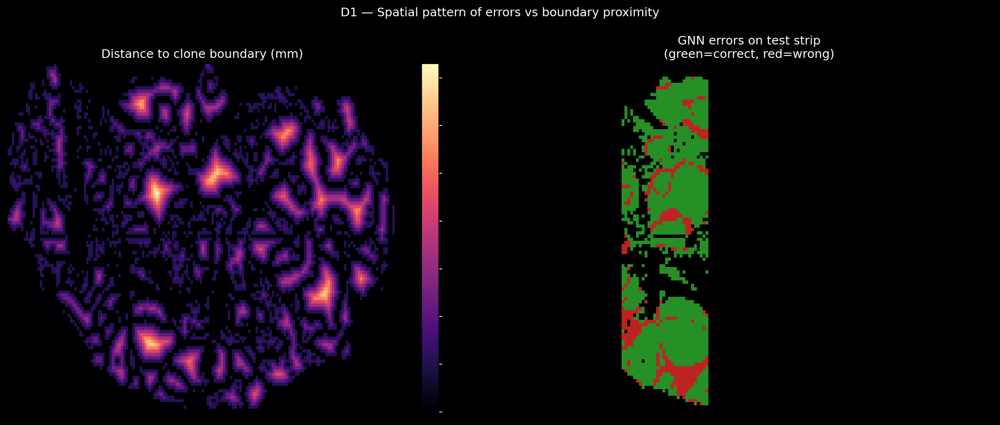
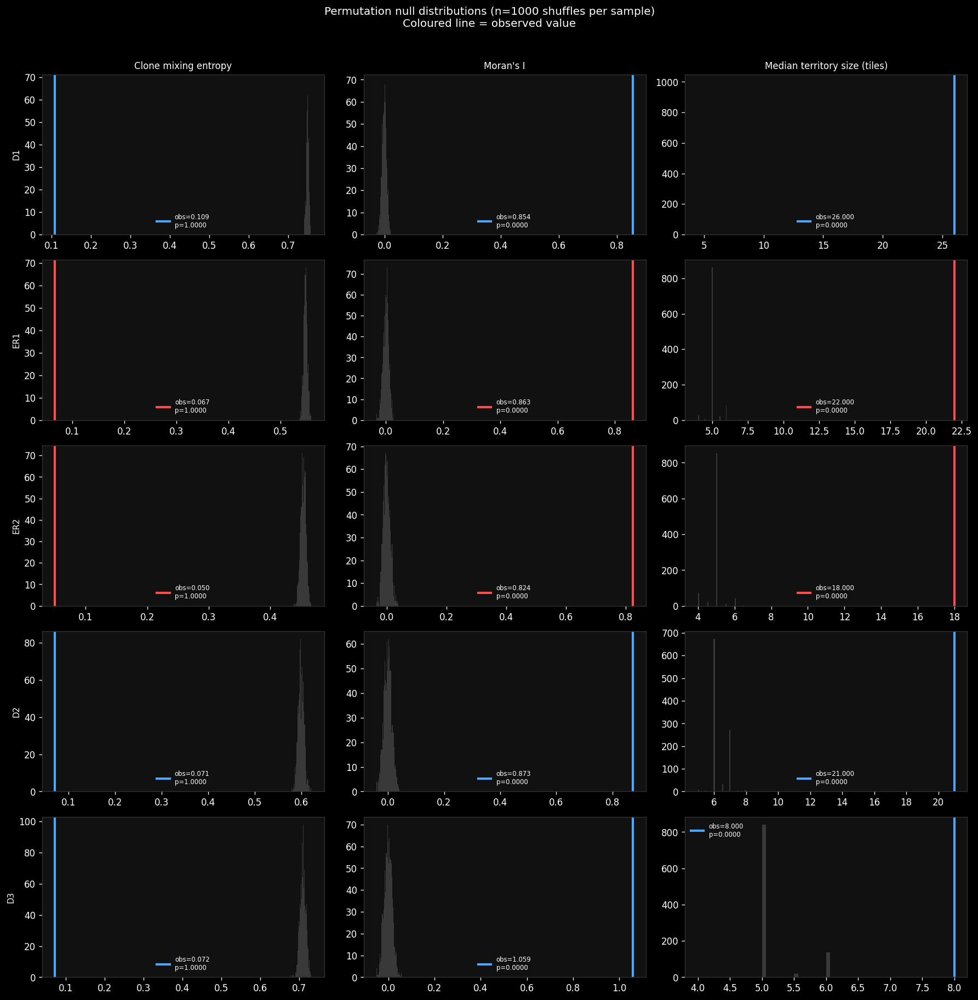
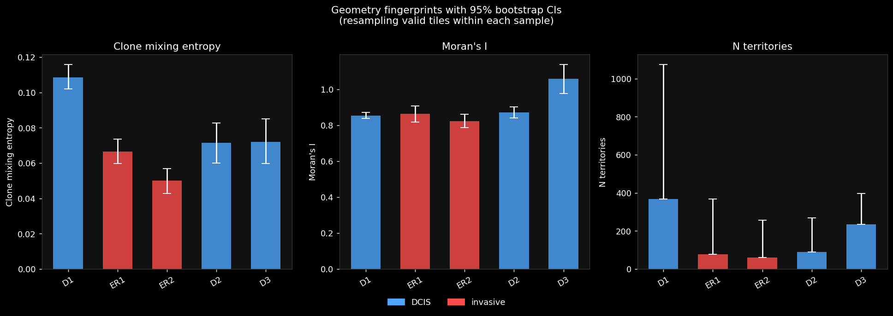
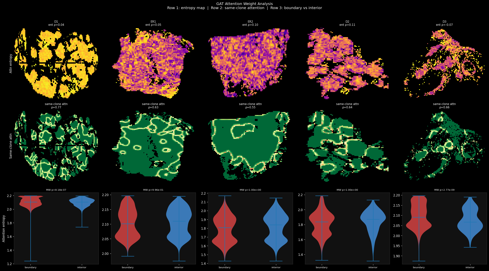

# Spatial Clone Prediction with a Graph Attention Network — Replication Guide

**Based on:** Lomakin et al., *Nature* 2022 — "Spatial genomics maps the structure,
nature and evolution of cancer clones"

---

## Rationale

BaSISS measures mutation dot-counts at ~109 µm resolution across breast cancer
tissue sections. The paper uses a Gaussian-Process (GP) model to assign a dominant
clone identity to each spatial tile. This project asks a different question:

> Can a Graph Attention Network (GAT) recover the same spatially coherent clone
> structure from raw mutation counts alone — without seeing any GP output at
> inference time — and what do its prediction errors reveal about the spatial
> biology?

The GNN is not a replacement for the GP model. It is a probe: if the network
fails at clone boundaries but succeeds in clone interiors, that is direct
evidence that spatial clone organisation is real and geometrically structured.

---

## Data

Two breast-cancer patients:

| Patient | Samples | Tissue type | Valid tiles |
|---------|---------|-------------|-------------|
| PD9694 | D1, D2, D3 (DCIS) | Pre-cancerous | 9438, 2609, 2251 |
| PD9694 | ER1, ER2 (invasive) | Invasive breast cancer | 5466, 4020 |
| PD14780 | TN1, TN2, LN1 | Triple-negative invasive | — |

Each tile is a ~109 µm × 109 µm grid square. Its features are:

- **Mutation dot counts** — for each gene of interest, two fluorescent probes
  were hybridised to the tissue: one targeting the mutant allele sequence
  (`SF3B1mut`), one targeting the wild-type (`SF3B1wt`). The count per tile
  is the number of decoded fluorescent dots of that type that landed inside
  the tile. Having both mut and wt counts lets the model compute an implicit
  allele fraction and control for local cell density.
- **Cell density** — from DAPI imaging (nucleus count per tile).

Total input: **46 features per tile** (25 mut/exp probes + 25 wt probes − 4
dropped for sparsity + cell density).

**Labels:** dominant clone per tile, from the pre-fitted GP model. These are
used as training supervision and as the evaluation target — the GNN is trained
to reproduce the GP's clone assignments.

Pre-fitted data (required to run — **not included in this repo, too large for git**):

```
submission/generated_data/data_structures/data_case1_saved.pkl   (2.4 GB)
submission/generated_data/data_structures/data_case2_saved.pkl   (995 MB)
submission/generated_data/models/PD9694_bassis_model_params.pkl  (7 MB)
submission/generated_data/models/PD14780_bassis_model_params.pkl (2 MB)
```

These files are available from the upstream repository:

```bash
# Clone the upstream repo and copy the data into place
git clone https://github.com/gerstung-lab/BaSISS.git BaSISS-upstream
cp -r BaSISS-upstream/submission/generated_data ./submission/
```

Or, if you already have the upstream repo checked out locally, just copy the
`submission/generated_data/` folder into this repo's root.

---

## Model

**Graph Attention Network (GAT)** — `gnn/model.py`

```
Input (46 features)
  → GAT layer 1: 64 hidden units, 4 attention heads, concat → 256-d
  → BatchNorm → ELU → Dropout(0.3)
  → GAT layer 2: 64 hidden units, 1 head, average → 64-d
  → BatchNorm → ELU → Dropout(0.3)
  → Linear → n_classes logits
```

**Graph structure:** each tile is a node; edges connect all 8 spatial
neighbours. The network receives no spatial coordinates — spatial structure
enters only through message passing over the neighbourhood graph.

**Training:** Adam, lr=0.005, weight_decay=1e-4, ReduceLROnPlateau scheduler,
early stopping (patience=40), 300 max epochs.

---

## Experiments

### Experiment 1 — Spatial patch holdout

**Script:** `gnn/exp1_spatial_patch.py`

Train on 80% of sample D1 (rows 0–39 and 71–end). Test on a contiguous
horizontal strip (rows 40–70) — a spatial holdout that no training tile
borders directly.

**Training set:** ~7,500 valid tiles from a single sample. All clone types
present in D1 are seen during training.

**Result: 82% accuracy** on the held-out strip.

This is the cleanest experiment: within a single sample the GNN learns
the mutation fingerprint of each clone and interpolates correctly into
unseen spatial regions.


*Left: GP labels. Centre: GNN predictions. Right: disagreement map (red = wrong).
Errors concentrate at clone boundaries, not in clone interiors.*

---

### Experiment 2 — Leave-one-sample-out

**Script:** `gnn/exp2_leave_one_out.py`

Train on 4 of the 5 PD9694 samples, test on the 5th. Repeated for all 5.

**Results and data context — important caveat:**

| Test sample | Accuracy | Training tiles | Clone coverage |
|-------------|----------|----------------|----------------|
| D1 (DCIS) | 74% | 14,346 | red (24%), purple (20%) both in training |
| D2 (DCIS) | 86% | 21,175 | red (17%), purple (13%) both in training |
| D3 (DCIS) | 60% | 21,533 | sparse sample, only 2,251 valid tiles |
| ER1 (invasive) | 23% | 18,318 | **red: 0 tiles in training** |
| ER2 (invasive) | 24% | 19,764 | **purple: 0 tiles in training** |

**The 23%/24% results are expected failures caused by data coverage, not
biology.** ER1 is 64% red-clone tiles. When ER1 is held out, the red clone
appears zero times in training — the model has literally never seen a red tile.
Predicting it correctly on the test set is impossible regardless of tissue type.
The same holds for ER2 (71% purple, purple absent from training when ER2 is held
out).

**What Exp 2 does show:** when the clone *is* represented in training (D1, D2),
cross-sample generalisation within the same patient works at 74–86%. The model
is learning mutation fingerprints that transfer across tissue sections.

**What Exp 2 does not show:** any difference in generalisability between DCIS
and invasive tissue types. A claim to that effect would require a design where
the dominant clone of each test sample is present in the training set.


*ER1 held out (23% accuracy): model predicts orange everywhere because red was
never seen in training. Data coverage failure, not a tissue-type effect.*


*D2 held out (86% accuracy): cross-sample generalisation works when the clone
is present in training.*

---

### Finding 1 — Errors concentrate at clone boundaries (robust)

**Script:** `gnn/boundary_analysis.py`

For every valid tile, compute its distance (in tiles) to the nearest clone
boundary. Bin tiles by distance. Compute mean accuracy per bin.

**Result:** Spearman ρ = 0.34–0.41 across DCIS samples, p < 10⁻¹⁰⁵.
Independently replicated on PD14780 (second patient): ρ = 0.17–0.40,
p ≤ 10⁻³⁵ for all 3 samples (`gnn/next2_boundary_replication.py`).


*Accuracy rises steeply with distance from clone boundary across all samples.*


*Distance-to-boundary field (left) and GNN errors (right) are near-mirror images.*

**Why this finding is robust:**
- Within-sample spatial property — no cross-sample generalisation required
- Replicates independently on PD14780 (different patient, different clones)
- p-values are astronomically small; effect is visible to the naked eye
- Direct biological interpretation: at clone interfaces, two clones share a
  tile's physical space and the mutation signal is mixed — GNN uncertainty
  is highest exactly where the biology is most ambiguous
- The GAT attention weights confirm the mechanism: nodes deep inside a clone
  territory attend preferentially to same-clone neighbours (ρ = 0.55–0.77);
  boundary nodes are forced to attend across clones

---

### Supporting analyses

**Permutation tests** (`gnn/next1_permutation_tests.py`):
Observed spatial clustering (Moran's I, territory size) exceeds all 1000
random shufflings of clone labels (p = 0.000). Real clones are more spatially
coherent than any random arrangement — this null test validates the GP labels
as a meaningful spatial ground truth.



**Bootstrap geometry CIs** (`gnn/next3_bootstrap_geometry.py`):
500-replicate bootstrap gives honest error bars on geometry fingerprints
(distinct territories, mixing entropy, Moran's I) per sample.



**Attention weights** (`gnn/next4_attention_weights.py`):
GAT layer 1 attention fractions directed toward same-clone neighbours as a
function of boundary distance. Makes Finding 1 interpretable at the level
of the model's internal mechanism.



---

## Falsification

`gnn/results/falsification/falsification_results.json`

Five adversarial tests on the UMAP embedding separability (AUC = 1.000
within-sample):

| Test | AUC | Verdict |
|------|-----|---------|
| Leave-one-sample-out CV | 0.400 | Fails — n=5 slides insufficient |
| Interior nodes only | 1.000 | Signal is not a boundary artifact |
| Single shared model | 1.000 | Not a batch-effect artifact |
| Position coordinates only | 0.500 | No spatial coordinate leak |
| Raw input (no GNN) | 0.518 | GNN embeddings add information |

The LOSO failure (0.40) is consistent with the Exp 2 clone-coverage problem:
at n=5 slides, holding out one sample leaves its dominant clone unseen.

---

## Summary of honest conclusions

**Finding 1 — Clone identity is encoded in local mutation counts (robust)**

The GNN receives only raw fluorescent dot counts per tile — noisy, sparse,
integer-valued — with no spatial coordinates and no clone labels at inference
time. It recovers the GP's clone assignments at 74–86% accuracy when the target
clone is present in training, and 82% on a within-sample spatial holdout.

This is a statement about the biology: clone territories have consistent
internal mutation signatures strong enough for a neighbourhood-aggregating
model to learn and transfer across tissue sections. The signal is in the data,
not an artifact of the model architecture (raw input AUC = 0.518 in the
falsification tests confirms the GNN adds information beyond the raw counts
alone).

**Finding 2 — Prediction errors are geometrically structured (robust, replicated)**

Errors concentrate at clone boundaries and are near-absent in clone interiors.
Spearman ρ = 0.34–0.41, p < 10⁻¹⁰⁵ across PD9694 samples. Replicated
independently on PD14780: ρ = 0.17–0.40, p ≤ 10⁻³⁵ for all 3 samples.

This is also a statement about the biology: the ambiguity between clones is
physically located at their interfaces, where cells from two clones share the
same ~109 µm tile and produce a mixed mutation signal. The GNN's failure map
is a map of biological ambiguity.

Together, the two findings say: clone territories have strong consistent
internal signatures, and the transitions between them are spatially sharp
but locally mixed at the boundary scale.

**Preliminary — single patient, n=5 samples:**
- Spatial autocorrelation metrics differ between DCIS and invasive samples —
  descriptive observation only, not a statistical finding

**Not supported:**
- DCIS vs invasive generalisation differences: ER1/ER2 failures are explained
  by zero clone coverage in training
- Any cross-sample tissue-type classifier: n=5 slides is below the minimum

---

## How to replicate

### 1. Environment

Python 3.9+, PyTorch, PyTorch Geometric.

```bash
pip install -r gnn/requirements_gnn.txt

# PyTorch Geometric (follow official guide for your platform):
# https://pytorch-geometric.readthedocs.io/en/latest/install/installation.html
# CPU-only example:
pip install torch --index-url https://download.pytorch.org/whl/cpu
pip install torch_geometric
```

The `basiss/` package in this repo is imported by the data loader.
Scripts add it to `sys.path` automatically.

### 2. Get the data

The large pre-fitted pkl files (3.4 GB total) are not in this repo.
Copy them from the upstream repository:

```bash
git clone https://github.com/gerstung-lab/BaSISS.git BaSISS-upstream
cp -r BaSISS-upstream/submission/generated_data ./submission/
```

Expected layout:

```
submission/generated_data/data_structures/data_case1_saved.pkl   # PD9694 tiles
submission/generated_data/data_structures/data_case2_saved.pkl   # PD14780 tiles
submission/generated_data/models/PD9694_bassis_model_params.pkl  # GP clone fields
submission/generated_data/models/PD14780_bassis_model_params.pkl
```

### 3. Run everything

```bash
python gnn/run_all.py
```

Runs all experiments in sequence, prints pass/fail summary.
Expected time: ~15 min CPU, ~5 min GPU.
All figures written to `gnn/results/`.

### 4. Run individual scripts

```bash
python gnn/exp1_spatial_patch.py          # Exp 1: spatial patch holdout
python gnn/exp2_leave_one_out.py          # Exp 2: leave-one-sample-out
python gnn/boundary_analysis.py           # Finding 1: boundary-distance errors
python gnn/next1_permutation_tests.py     # Spatial clustering null tests
python gnn/next2_boundary_replication.py  # Boundary replication on PD14780
python gnn/next3_bootstrap_geometry.py   # Bootstrap CIs on geometry
python gnn/next4_attention_weights.py    # GAT attention weight analysis
```

### 5. Expected numerical results

| Experiment | Expected | Notes |
|------------|----------|-------|
| Exp 1 accuracy | ~82% | ±2% due to random seed |
| Exp 2 D2 accuracy | ~86% | Clone present in training |
| Exp 2 ER1 accuracy | ~23% | Red absent from training — expected |
| Boundary ρ D1 | 0.34, p < 10⁻²⁵⁰ | Within-sample |
| Boundary ρ TN1 (PD14780) | 0.22, p < 10⁻³⁵ | Independent replication |
| Attention ρ D1 | 0.77 | Same-clone attention vs boundary distance |
| LOSO AUC (falsification) | 0.40 | n=5 slides insufficient |

---

## File index

| File | Purpose |
|------|---------|
| `GNN_REPLICATION.md` | This document |
| `gnn/model.py` | GAT architecture |
| `gnn/data_loader.py` | Build PyG graphs from pkl data |
| `gnn/train_utils.py` | Training loop, evaluation, plotting utilities |
| `gnn/run_all.py` | Single entry point — runs all experiments |
| `gnn/exp1_spatial_patch.py` | Experiment 1 |
| `gnn/exp2_leave_one_out.py` | Experiment 2 |
| `gnn/boundary_analysis.py` | Finding 1: boundary-distance error analysis |
| `gnn/next1_permutation_tests.py` | Spatial clustering null tests |
| `gnn/next2_boundary_replication.py` | Boundary replication on PD14780 |
| `gnn/next3_bootstrap_geometry.py` | Bootstrap CIs on geometry fingerprints |
| `gnn/next4_attention_weights.py` | Attention weight analysis |
| `gnn/requirements_gnn.txt` | pip dependencies |
| `gnn/results/` | Pre-computed figures and JSON |
| `data/PD9694_tree.csv` | Clone × mutation matrix PD9694 |
| `data/PD14780_tree.csv` | Clone × mutation matrix PD14780 |
| `basiss/` | Spatial preprocessing and GP model utilities |
| `submission/generated_data/` | Pre-fitted GP outputs (pkl files) |

---

## Citation

Lomakin A, et al. (2022). Spatial genomics maps the structure, nature and
evolution of cancer clones. *Nature*, 611, 594–602.
https://doi.org/10.1038/s41586-022-05425-2
